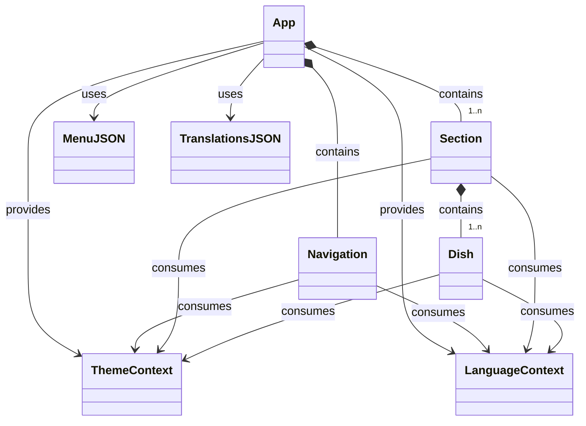

# Primera aproximación para Carta digital

Se trata de el planteamiento de menú digital multilingüe para un restaurante, desarrollada con React.

Sus objetivos son:

1. Visualización del menú: Mostrar las diferentes secciones de la carta (desayunos, la carta, brasa, postres y bebidas) con sus respectivos platos, descripciones y precios.
2. Soporte multilingüe: Permite a los usuarios cambiar entre tres idiomas: castellano, catalán e inglés. Todos los textos del menú se actualizan dinámicamente según el idioma seleccionado.
3. Modo claro/oscuro: Incluir la opción de alternar entre un tema claro y oscuro para mejorar la legibilidad en diferentes condiciones de iluminación.
4. Navegación intuitiva: Permitir a los usuarios poder navegar fácilmente entre las diferentes secciones del menú a través de un componente de navegación.
5. Diseño responsivo: La aplicación estará diseñada para adaptarse a diferentes tamaños de pantalla, desde dispositivos móviles hasta pantallas de escritorio.
6. Estructura modular: La aplicación se construirá sobre componentes React reutilizables, lo que facilitará su mantenimiento y ampliación.
7. Gestión de estado eficiente: Utilizar React Context para manejar el estado global de la aplicación, incluyendo el idioma seleccionado y el modo de tema.

## Diagrama

